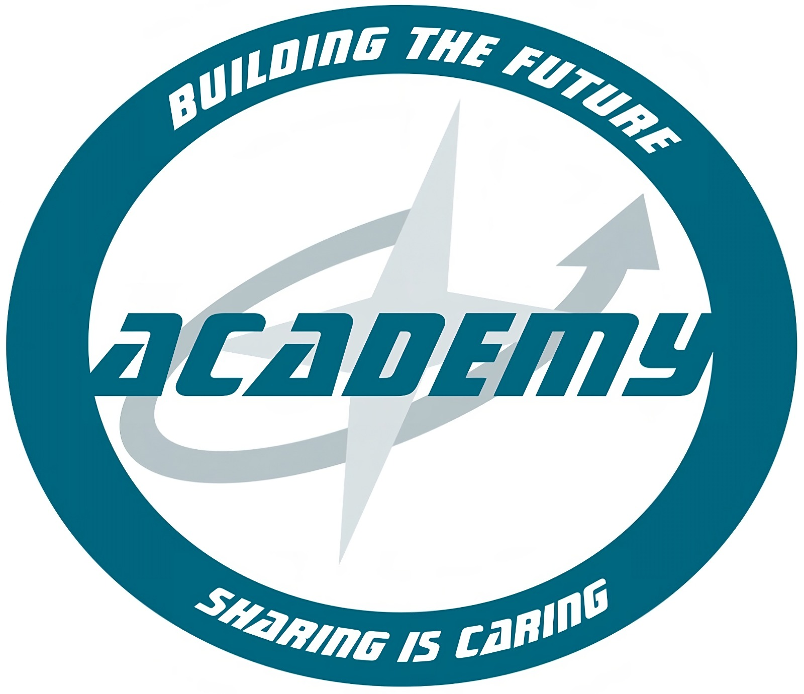

<!-- Primeiro slide com borda ao redor de todo o slide -->

  

  # 

  # DevOps Introduction
  ### DevOps Definition
  #### CYBERNETES | OCT 2024

---

  

  ##### What is DevOps?
  
  >A compound of development (Dev) and operations (Ops), DevOps is the union of people, process, and technology to continually provide value to customers.
  

---

 

##### The origin of DevOps
* Originating in the early 2000s, DevOps evolved as an extension of Agile principles, incorporating operational aspects such as deployment, monitoring, and infrastructure management. It aimed to enhance collaboration, streamline processes, and automate software delivery beyond development phases alone.

---

 

##### The evolution of DevOps
1. **Origins and Conceptualization (2000s):** DevOps emerged as a response to improve collaboration between development and operations teams, focusing initially on process automation and continuous integration to accelerate software delivery.

2. **Increasing Adoption (2010s):** Throughout this decade, DevOps gained traction as organizations recognized its benefits for rapid and reliable software delivery. Specialized tools and practices like container orchestration (e.g., Docker, Kubernetes) and Infrastructure as Code (IaC) became prevalent.

3. **Integration with Security and Governance (2010s - 2020s):** DevOps matured with greater integration of security practices (DevSecOps) and governance. Automated security pipelines, compliance checks, and continuous monitoring were implemented to ensure security throughout the development lifecycle.

---

 

##### The evolution of DevOps (Cont)
4. **Expansion into Organizational Culture:** Beyond a technical practice, DevOps became an organizational culture promoting interdisciplinary collaboration, shared responsibility, and continuous learning and improvement.

5. **DevOps in the Cloud Era (2020s onwards):** With the rise of cloud computing and complex distributed architectures, DevOps continues to evolve to support multi-cloud and hybrid environments. Advanced observability practices, cloud governance automation, and predictive analytics tools are enhancing operational efficiency.

---

 

##### DevOps Benefits for Organizations
DevOps core values, encapsulated in **CAMS (Culture, Automation, Measurement, Sharing)**, are essential for effective implementation and organizational benefit.
* **Culture**  is the first element, addressing the historical divide between Development and Operations teams, which led to increasing barriers with different goals and objectives; understanding the organization's shared culture and the specific needs and challenges of each team sets the foundation for automation.
* **Automation**   facilitates the creation and control of application and system procedures, leveraging technology to solve problems and prevent future issues.

---

 

##### DevOps Benefits for Organizations (Cont)
* **Measurement** evaluates the effectiveness of changes through metrics such as service restoration time, cycle time for deploying new features, costs, revenue, and employee satisfaction.
* **Sharing**  is about fostering teamwork, transparency, and collaboration. Information can be shared through documentation, pair programming, peer reviews, mentoring, and inclusive practices, ensuring that knowledge is disseminated and utilized effectively within the organization.

---

  ###### Culture VS Role 

---

 
 

##### Culture VS Role
 * DevOps culture emphasizes collaboration, communication, and shared responsibility, promoting continuous delivery and ongoing improvement.
* While **roles** provide specialized **skills**, it is the DevOps **culture** that drives **innovation, operational efficiency,** and organizational success by fostering adaptability and a focus on outcomes in a fast-paced digital landscape.

---

 
 
###### DevOps Culture's Impact on IT Teams

---

 

##### Why we need a DevOps Culture?
 Without a DevOps culture, organizations face **significant challenges** that hinder **efficiency** and **innovation.** One major issue is the *"Wall of Confusion"* where a barrier is created between departments instead of fostering connections to achieve common goals. This separation leads to **misaligned efforts** and **objectives**, ultimately slowing down progress.

---

 

##### Costs of a Disaligned Culture
 When there is no alignment in culture, investments made to shorten production times can have the opposite effect. This results in:
 1. **Wasted time**: Efforts are duplicated or misdirected, leading to inefficiencies.
 2. **Wasted resources**: Resources are not utilized optimally, increasing operational costs.
 3. **Loss of competitive advantage**: The inability to innovate and adapt quickly puts the organization at a disadvantage compared to competitors.

---

 

##### DevOps Culture
 Implementing a DevOps culture helps break down silos, align objectives, and optimize resource use, ensuring the organization can respond swiftly to market changes and maintain a competitive edge. It emphasizes:
 1. **Communication**: Open and transparent communication across teams.
 2. **Collaboration**: Close cooperation between development and operations teams to achieve shared goals.
 3. **Continuous learning**: An environment that encourages ongoing education, adaptation, and improvement.
---

 

###### Chapter Quiz
###### (Kahoot)

---

 

##### 1 - What is the first element of the core values of DevOps (CAMS)?
a) ***Automation***

b) ***Culture***

c) ***Measurement***

d) ***Sharing***

---

 

##### 2 - What are the three main aspects of DevOps culture mentioned?
a) ***Security, Compliance, Scalability***

b) ***Communication, Collaboration, Continuous learning*** <-

c) ***Planning, Execution, Monitoring***

d) ***Innovation, Sustainability, Competitiveness***

---

 

##### 3 - Explain the concept of "Wall of Confusion" in the context of DevOps and how it affects IT teams.
a) **It is a physical barrier separating development and operations teams.**

b) **It refers to a barrier of communication and differing goals between teams, hindering collaboration and efficiency.**

c) **It signifies a strict policy limiting communication between departments.**

d) **It indicates a strategy to enhance information security in the organization.**

---

 

##### 4 - What are the costs of a misaligned culture, and how can automation help mitigate these issues in a DevOps organization?
a) **Increased profit and reduced operational costs; automation can simplify complex tasks.**

b) **Wasted time, wasted resources, and loss of competitive advantage; automation can improve efficiency and reduce errors.**

c) **Increased customer satisfaction and market expansion; automation can accelerate the development of new products.**

d) **Decreased productivity and increased rework; automation can reduce the number of required employees.**

---

