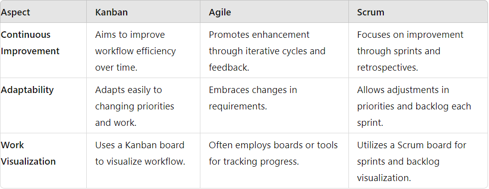
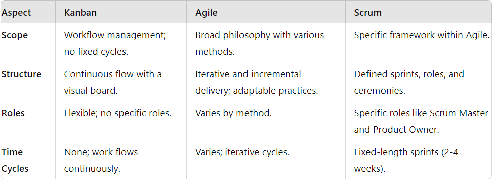

<!-- Primeiro slide com borda ao redor de todo o slide -->

  

  # 

  # LEAN & KANBAN
  #### CYBERNETES | OCT 2024

 ---

  

  ##### What means *Lean*?
  
  >*Lean* is an approach focused on **optimizing** the **flow of products** and services across various teams and technologies to **deliver maximum value to customers**. By **eliminating waste** and streamlining operations, every action taken by the team is intentional and directly contributes to the end goals.
 
  ---
  
  

  ##### *Lean* Principles
  
  **1. Eliminate waste**: *Focus on removing any activities or processes that do not add value to the product or the customer. This includes reducing unnecessary steps, avoiding overproduction, and minimizing defects.*
 
  **2. Build Quality In**: *Ensure quality is maintained at every stage of the development process. This involves integrating testing and quality assurance practices early and continuously, preventing defects rather than detecting them later.*

  **3. Create Knowledge**: *Promote a culture of learning and continuous improvement. Encourage teams to document their processes, share insights, and learn from both successes and failures.*

  **4. Defer Commitment**: *Make decisions based on the latest possible information. This helps in avoiding premature decisions that could lead to rework and ensures that choices are made with the best available data.*
 
  ---
    
  

  ##### *Lean* Principles (Cont)
 
  **5. Deliver Fast**: *Reduce cycle times and deliver working software quickly. This allows for faster feedback from customers and the ability to respond to changing market needs swiftly.*

  **6. Respect People**: *Foster a respectful work environment where team members are valued and empowered. This principle emphasizes collaboration, trust, and the recognition of each individual's contributions.*

  **7. Optimize the Whole**: *Focus on the entire value stream rather than optimizing individual parts. This holistic approach ensures that improvements in one area do not create bottlenecks or inefficiencies in another, leading to a more efficient and effective overall process.*

  ---
  
  

  ##### What is *Kanban*?
  
  >*Kanban* is a Japanese word meaning ***"signboard"*** or "***visual board"***, and its also an agile methodology that originated in Japan and was widely used by Toyota to improve manufacturing efficiency. In software development and project management, Kanban is used to **visualize work**, **limit work in progress (WIP)**, and **maximize workflow efficiency**.
 
  ---
    
  

  ##### How to implement *Kanban*?
  
 **1. Current Practices**: *Map and visualize the current workflow on a Kanban board to identify how work is progressing and where bottlenecks may be.*
 
  **2. Visualize the Workflow**: *Create a Kanban board with columns representing different stages of the process (**"To Do," "In Progress," "Done"**). Move work items between these columns to show progress.*

  **3. Limit Work in Progress (WIP)**: *Set limits on the number of tasks that can be in progress in each column to prevent overload and ensure a smooth and efficient workflow.*

  ---
      
  

  ##### How to implement *Kanban*? (Cont)
  
 **4. Manage and Measure Flow**: *Monitor the workflow using metrics such as cycle time and lead time. Identify and eliminate bottlenecks to improve delivery speed and quality.*
 
 **5. Make Policies Explicit**: *Define and document clear rules for the process, including criteria for moving items between columns and managing blockers, to ensure alignment and transparency.*

 **6. Incorporate Feedback Loops**: *Hold regular meetings, such as daily stand-ups and retrospectives, to assess progress, identify issues, and make continuous adjustments.*

 **7. Incorporate Feedback Loops**: *Encourage the team to continuously seek ways to improve the process and increase efficiency, fostering a culture of incremental and ongoing improvement.*

  ---
          
  

  ### Kanban, Agile, and Scrum

  ##### Similarities
  
  # 

  ---
          
  

  ### Kanban, Agile, and Scrum

  ##### Differences
  
# 
   
  ---
        
  

  ##### Kanban Benefits in Devops
  
>Using Kanban in DevOps provides a structured yet flexible approach to managing workflows, enhancing efficiency, and fostering continuous improvement. By visualizing work, limiting WIP, and embracing feedback loops, teams can improve collaboration, adapt to changes, and deliver value more effectively.

  ---
