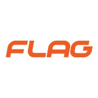

<!-- Primeiro slide com borda ao redor de todo o slide -->

  

  # 

  # Metodologias Ágeis para Gestão de Projetos: Scrum
  ### 2. Comparativos e Gestão Ágil de Projetos
  #### FLAG | NOV 2024

---

  

  
##### 2.1 Waterfall vs Agile
##### 2.2.1 Diferenças fundamentais
##### 2.2.2 Fases do Processo Agile
##### 2.3 Cenários de aplicação
##### 2.5 Características principais
##### 2.4 Benefícios e desafios

 
  
  

---

 

###### Waterfall

---

 

##### Waterfall
>*"O modelo **Waterfall** é uma abordagem sequencial de gestão de projetos, onde cada fase deve ser completada antes que a próxima tenha início. É mais eficaz em projetos com requisitos bem definidos e mudanças limitadas ao longo do desenvolvimento."* - **SOMMERVILLE, Ian. Software Engineering. 9th ed. Boston: Addison-Wesley, 2011**

---

 

##### Características de Waterfall
1.**Fases sequenciais**

2.**Inflexibilidade de Mudanças** 

3.**Ideal para requisitos bem definidos desde o início**

4.**Foco na documentação detalhada**

---

 

##### Agile
>*"**Agile** é uma abordagem de gestão de projetos que foca em entregas iterativas, flexibilidade e adaptação contínua, que prioriza a colaboração com o cliente. Procura entregar valor rapidamente e melhorar constantemente os processos."* - **Highsmith, J. (2002). Agile Software Development Ecosystems. Addison-Wesley**

---

 

##### Características de Ágile

1.**Entregas iterativas e incrementais**

2.**Alta adaptabilidade a mudanças**

3.**Ideal para Requisitos Evolutivos**

4.**Feedback contínuo do cliente**

---

  ##### Waterfall vs Agile
→ **Waterfall**: Modelo sequencial e rígido. Utilizado em indústrias onde os requisitos e processos são altamente estruturados e bem definidos desde o início, devido à sua abordagem sequencial e rígida, Exemplo: Construção Civil, Saúde e Farmacêutica

→ **Agile**: Abordagem iterativa e adaptativa. Utilizado em indústrias onde os requisitos podem mudar com frequência, onde há necessidade de flexibilidade e onde a colaboração contínua com os clientes agrega valor ao produto final. Exemplo: Desenvolvimento de Software, Marketing Digital

---

 

###### Fases do Agile

---

 

As **6 fases do processo ágil** representam um ciclo genérico de desenvolvimento, utilizado em diversas metodologias ágeis.

1. **Planeamento do Projeto**  
   Definição de objetivos, requisitos e escopo do projeto.

2. **Análise e Design**  
   Elaboração de soluções técnicas e arquitetura do sistema, com garantia que o produto atenda aos requisitos definidos.

3. **Desenvolvimento**  
   Implementação do código e funcionalidades, com foco em criar um produto funcional e de qualidade.

---

 

4. **Testes**  
   Validação do sistema, garantindo que ele atenda aos requisitos definidos e esteja livre de erros.

5. **Entrega e Implementação**  
   Colocação do produto em produção ou disponibilização para o cliente, com garantia que tudo esteja a funcionar corretamente.

6. **Manutenção e Melhoria Contínua**  
   Após a entrega, são feitos os ajustes com base no feedback do cliente, sempre em busca de melhorar o produto.

---

 
 

 ###### Caso Prático:
 ###### Cenário de Aplicação

---

 
 
##### Exemplos de Agile e Waterfall aplicados à TechFit

**Agile:**
1. **Desenvolvimento de uma Aplicação de Treino Personalizado**  
   A TechFit é uma aplicação de treino, que começa com versões beta de funcionalidades básicas (MVP). Recolhe feedback dos utilizadores e ajusta a aplicação de forma iterativa com base nas necessidades dos clientes.

2. **Implementação de uma Plataforma de Suporte ao Cliente**  
   A TechFit cria uma plataforma dentro da sua app de suporte ao cliente para auxiliar os utilizadores da aplicação. Começa com funcionalidades básicas como FAQs e um chatbot. Posteriormente, adiciona recursos avançados, como abertura de tickets para resolução de problemas técnicos com a app.

---

 

**Waterfall:**
1. **Criação de um Sistema de Relatórios Financeiros regulamentado pelo Ministério das Finanças**  
   A TechFit desenvolve um módulo de relatórios fixo, com funcionalidades completamente delineadas no início do projeto, sem permitir alterações após o início do desenvolvimento.

2. **Desenvolvimento de um Sistema de Gestão de Colaboradores regulamentado pela Segurança Social**  
   A TechFit desenvolve um sistema de gestão de clientes onde todos os requisitos são regidos por uma padrão, e mudanças significativas no sistema só podem ser feitas com autorização da identidade governamental

---

 

##### O que é Gestão Ágil de Projetos?
 >*"A **Gestão Ágil de Projetos** é uma abordagem que utiliza princípios e práticas de metodologias ágeis para gerir projetos de **forma flexível e adaptativa**, focando-se na entrega incremental de valor, colaboração constante com o cliente e resposta rápida a mudanças. Essa abordagem visa aumentar a eficiência e a qualidade dos projetos, permitindo maior adaptabilidade e satisfação do cliente."* - **Highsmith, J. (2002). Agile Software Development Ecosystems. Addison-Wesley**

---

 

##### Características Principais

***→ Foco no cliente:*** Entrega contínua de valor.

***→ Iteratividade e Incrementalidade:*** Ciclos de trabalho curtos (sprints).

***→ Comunicação constante:***  Colaboração contínua com a equipa e stakeholders.

***→ Flexibilidade:***  Capacidade de adaptação a mudanças no escopo e nos requisitos.

---

 

###### Benefícios e Desafios

---

 

##### Benefícios

**→ Entrega contínua de valor:** Incrementos frequentes e melhoria contínua.

**→ Maior flexibilidade:**  Capacidade de adaptação a mudanças.

**→ Envolvimento da equipa:** Melhora a motivação e a colaboração interna.

**→ Maior satisfação do cliente:** Feedback contínuo e entregas incrementais.

---

 

##### Desafios

**→ Resistência à mudança:**: Adaptação a novos métodos pode ser difícil para algumas equipas acostumadas a trabalhar em método Waterfall.

**→ Exigência de comprometimento total:** Todos os membros da equipa precisam estar altamente envolvidos e preparados para a crítica construtiva.

**→ Dificuldade em escalar**: Pode ser complexo gerir grandes projetos com várias equipes ágeis. Envolveria gerir múltiplas equipas de forma colaborativa, que exige um esforço significativo para alinhar objetivos, prazos e entregas. Ex: alinhar a sintonia entre as equipas de frontend e backend para entregar a aplicação no prazo estipulado.

**→ Falta de documentação detalhada**:  Em ambientes ágeis, a ênfase na entrega rápida pode levar à falta de documentação suficiente, o que pode dificultar a compreensão do projeto por novas equipas ou durante transições. 

