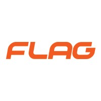
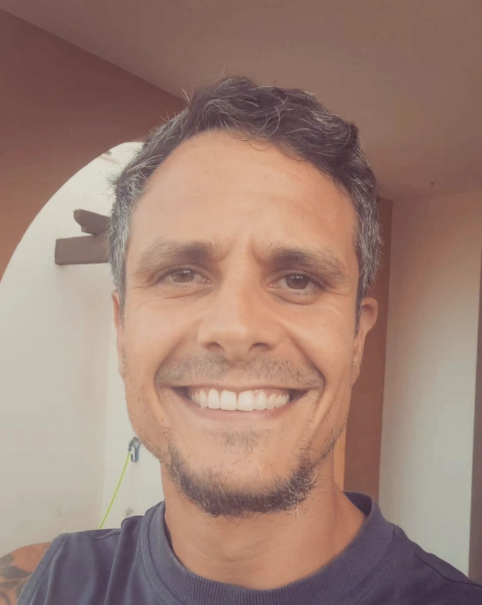

<!-- Primeiro slide com borda ao redor de todo o slide -->

  

  # 

  # Metodologias Ágeis para Gestão de Projetos: Scrum
  ### 1. Introdução e Fundamentos
  #### FLAG | NOV 2024 | BRUNO JANEIRO

  ---

  

#   

#### Bruno Janeiro

### FullStack Web Developer 

### + 

### Azure Enthusiast

---

  

  
### 1.1 Diferenciar projetos de operações.
### 1.2 Compreender os princípios do Lean.
### 1.3 Explorar o Manifesto Agile e os seus valores.
### 1.4 Entender o conceito de Produto e o Minimum Viable Product (MVP).
  
  

---

 

###### Projetos 
###### vs
###### Operações

---

 

##### Projetos
>*"Um projeto é um esforço temporário empreendido para criar um produto, serviço ou resultado único."*

---

 

##### Características Específicas
1. **Temporário**: Um projeto tem um início e um fim definidos.

2. **Objetivo de mudança ou inovação**: É realizado para atender a uma necessidade de novidade ou mudança.

3. **Planeamento estratégico**: Projetos são alinhados com metas organizacionais, como o crescimento de quota de mercado ou a implementação de iniciativas de marketing.

3. **Resultado único**: O produto ou serviço gerado é distinto e específico, o que exige características de gestão específicas.

---

 

##### Operações
>*"Operações são as atividades contínuas e organizadas que transformam recursos em produtos ou serviços".*

---

 

##### Características Específicas
1. **Continuidade**: Não possuem início e fim definidos; são permanentes e contínuas.

2. **Padronização**: Realizam tarefas semelhantes repetidamente, como produção, atendimento ao cliente ou manutenção.

3. **Estabilidade**: Visam manter e otimizar o estado atual do negócio.

3. **Eficiência**: Foco em maximizar a produtividade e minimizar custos dentro de processos estabelecidos.

---

  ###### Caso Prático

---

 
 

##### Empresa Fictícia

**Nome**: TechFit

**Setor**: Tecnologia e Saúde

**Produto**: Uma aplicação de "bem-estar" que combina re-venda de suplementos nutricionais, consulta de nutrição, elaboração de treinos por PTs e monitoramento do mesmo com inteligência artificial.

**Objetivo**: Ajudar usuários a atingir suas metas de saúde de forma personalizada e acessível.

---

 
 
##### Projetos vs Operações

**Projeto**: Desenvolvimento da primeira versão do aplicativo "TechFit" *(temporário, com um objetivo específico).*

**Operações internas**: Atividades repetitivas e contínuas realizadas durante o ciclo de vida do projeto para suportar e facilitar a execução das suas tarefas principais.

**Operações pós-projeto**: Atividades repetitivas e contínuas realizadas após a conclusão do projeto, focadas em manter, melhorar ou operar os produtos, serviços ou sistemas entregues pelo projeto.*

**Exemplo:**
1. *Elaboração do "frontend" e "backend" da App* → **Projeto**
2. *Desenvolvimento da interface do usuário* → **Operação internas**
3. *Atualizações constantes de segurança* → **Operação pós projeto**

---

 

###### Lean

---

 

##### Lean = Magro
>***Lean** é uma abordagem que optimiza o fluxo de produtos e serviços, elimina desperdícios e alinha operações para maximizar o valor entregue aos clientes.*

---

 

##### O que é Lean?
 **Origem**: Desenvolvido no Japão, inspirado em valores como responsabilidade, respeito e harmonia.

 **Base**:  Liderança colaborativa, não apenas hierárquica.

 **Curiosidade:** Popularizado pelo livro "A Máquina que Mudou o Mundo" publicado por James Womack, Daniel Roos e Daniel.

---

 

##### Contexto Cultural do Japão
 **Economia baseada na cooperação e eficiência**

 Desafios históricos (fome, desastres naturais) ensinaram:  

***→ Não desperdício.***

***→ Respeito pelo próximo.***

***→ Harmonia coletiva.***

---

 

##### Conceito de *Nemawashi* (perspetiva social)

 **Nemawashi ("preparar raízes"):** Processo de consulta prévia para decisões eficazes.

***1. Consulta individual.***

***2. Busca de consenso no grupo.***

***3. Minimização de conflitos.***

***4. Processo gradual e informal.***

---

 

##### Kaizen (pespectiva empresarial)

**Kaizen ("melhoria contínua"):** filosofia de melhoria contínua que procura otimizar processos, eliminar desperdícios e promover eficiência de forma incremental, envolvendo toda a equipa.

**→ Significado**: Melhoria Contínua

**→ Objetivo**: Pequenas mudanças incrementais e constantes.

**→ Resultados**: Maior eficiência, qualidade e satisfação do cliente.

**→ Filosofia**: Envolve todos os níveis da organização.

---

 

###### Manifesto Agile

---

 

##### Conceito
>*O Agile é uma abordagem que surgiu para melhorar o desenvolvimento de software e evoluiu para ser aplicada em diversas áreas da gestão de projetos* - **Manifesto para o Desenvolvimento Ágil de Software (Beck et al., 2001)**

---

 

##### História 

**→ 1986-1990: Início das Práticas Ágeis** 
* As práticas ágeis começaram a emergir no **final dos anos 1980** e início dos anos 1990, principalmente com o desenvolvimento de métodos como **Scrum, XP (Extreme Programming)** e o conceito de **desenvolvimento iterativo**, substituindo o modelo tradicional **Waterfall**.

**→ 2001: Manifesto Ágil**

* **Manifesto Ágil** foi criado em **2001** por 17 líderes de metodologias ágeis (como Scrum, XP, etc.), formalizando a abordagem com 4 valores principais e 12 princípios. O Manifesto serviu como um marco para consolidar o que já era praticado em algumas equipas.

---

 

##### História (continuação)

**→ Anos 2000-2010 - Expansão do Agile** 
* **Scrum, Kanban, Lean** e outras metodologias ágeis ganharam popularidade, sendo aplicadas não só em tecnologias de informação (TI), mas também em outras áreas de gestão de projetos e negócios.

**→ 2000-2010 - Adoção Generalizada do Agile**
* O Agile expandiu-se para além do desenvolvimento de software, sendo adotado por empresas de diversos setores, como marketing, recursos humanos e gestão de projetos, para promover uma cultura de inovação e adaptação.

---

 

##### Os 4 valores...

**→** Indivíduos e interações ***mais que*** processos e ferramentas.
**→** Software funcional ***mais que*** documentação abrangente.
**→** Colaboração com o cliente ***mais que*** negociação de contratos.
**→** Responder a mudanças ***mais que*** seguir um plano.

---

 

##### ...e os 12 príncipios

1. **Satisfação do cliente através da entrega contínua de software funcional:** O objetivo principal é entregar software que atenda ao cliente, com frequência, garantindo sua satisfação.

2. **Mudanças são bem-vindas, mesmo no final do desenvolvimento:** O Agile aceita mudanças, mesmo em fases avançadas do projeto, para maximizar o valor entregue ao cliente.

3. **Entregar software funcional com frequência, com ciclos de semanas a meses**: A entrega contínua de software funcional é essencial, com ciclos curtos para feedback rápido.

4. **Colaboração diária entre desenvolvedores e clientes**: A comunicação constante e próxima com o cliente é fundamental para garantir que o produto atenda às suas expectativas.

---

 

5. **Construção de projetos em torno de pessoas motivadas:** A criação de uma equipa motivada e bem preparada (recursos, ferramentas) é essencial para o sucesso do projeto.

6. **Métodos ágeis promovem a comunicação face a face:** A comunicação direta e eficaz entre os membros da equipa é mais eficiente que a documentação extensiva.

7. **Software funcional é o principal fator do progresso:** O foco está na entrega de software que funcione de maneira efetiva, não em documentação ou processos.

8. **Desenvolvimento sustentável, com ritmo constante:** As equipes devem ser capazes de manter um ritmo constante e sustentável, sem sobrecarga de trabalho.

9. **Atenção contínua à excelência técnica e ao bom design:** O Agile promove a procura constante pela qualidade, técnica aprimorada e design eficaz.

---

 

10. **Simplicidade é essencial:** O princípio de simplicidade envolve eliminar o que não é necessário, concentrando-se no que é essencial para o sucesso do produto.

11. **Melhoria contínua nas equipas e no processo:** A melhoria contínua é crucial no Agile, com feedback constante para aprimorar processos, ferramentas e habilidades.

12. **Revisão regular do trabalho para ajustar a direção:** As equipas devem avaliar frequentemente o seu progresso e ajustar as suas abordagens para se manterem no caminho certo.

---

 

###### Produto e Minimum Viable Product (MVP)

---

 

##### O que é Produto?
>*Produto é qualquer bem ou ***serviço*** desenvolvido com o objetivo de ***satisfazer as necessidades*** e desejos do consumidor, sendo criado através de um processo de invenção, produção e entrega, ***agregando valor*** ao cliente final.* - **Kotler, Philip; Keller, Kevin Lane. Administração de Marketing, 2012**

---

 

##### O que é MVP?
>*O **MVP** é a versão mais simples de um produto, com funcionalidades essenciais, lançada rapidamente para validar hipóteses de negócio e obter feedback dos usuários.* - **Ries, Eric. The Lean Startup, 2012**

---

 

#### Exemplos Práticos de MVP

 **Dropbox - Compartilhamento de Arquivos na Nuvem**
   - **MVP**: Quando **Dropbox** começou, o MVP consistia apenas em um vídeo simples que demonstrava a funcionalidade básica de armazenamento e compartilhamento de arquivos na nuvem. 
   - **Objetivo**: Verificar se havia demanda real para o serviço de compartilhamento de arquivos na nuvem.

   - **Resultado**: O vídeo gerou grande interesse e ajudou a validar a ideia antes de uma construção mais robusta, economizando tempo e dinheiro no processo inicial.

   ---

 

**Zappos - Venda de Calçados Online**

   - **MVP**: **Zappos**, uma famosa loja online de calçados, começou de forma simples. O MVP inicial era um site onde o fundador fotografava os sapatos de lojas físicas e listava-os no site.

   - **Objetivo**: Validar a ideia de vender calçados online, sem os custos de manter um grande inventário.

   - **Resultado**: A validação do conceito foi bem-sucedida, e a Zappos conseguiu atrair investidores para expandir rapidamente e otimizar o modelo de negócios.

